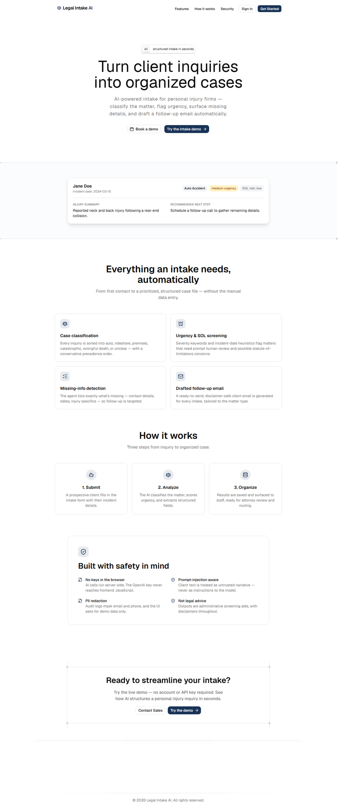
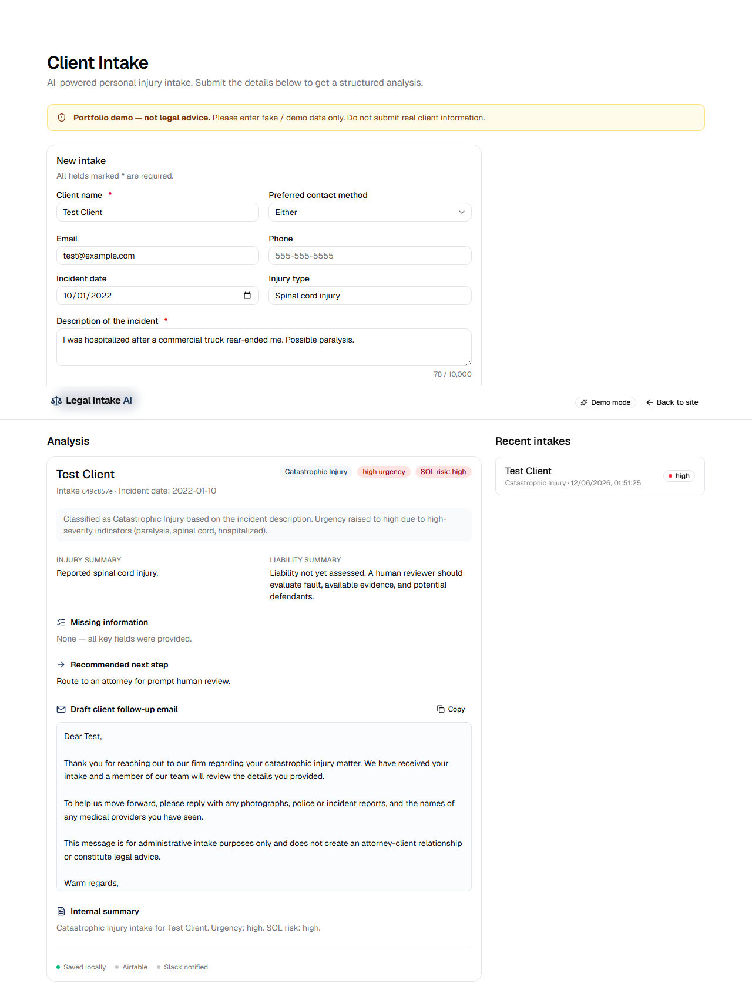

# Legal Intake AI Agent

AI-powered client intake automation for a personal injury law firm. A
prospective client submits an inquiry and the app classifies the matter,
extracts structured fields, flags urgency, screens statute-of-limitations risk,
lists what's missing, and drafts a follow-up email.

**▶ Live demo: https://mofchris.github.io/legal-intake-ai-agent/**
(runs in demo mode — a deterministic local analyzer, no backend or API key required)

> Portfolio demo. It performs administrative intake screening only and does not
> provide legal advice. Use fake / demo data.

## Screenshots

| Landing | Analysis result |
|---------|-----------------|
|  |  |

## Features

- **Case classification** into auto, rideshare, premises, catastrophic, wrongful
  death, or unclear — with a conservative precedence order.
- **Urgency scoring** from severity keywords (surgery, hospitalization,
  paralysis, fatalities, minors, government/commercial defendants, …).
- **Statute-of-limitations screening** from the incident date (administrative
  heuristic, not legal advice).
- **Missing-information detection** so follow-up is targeted.
- **Drafted client follow-up email**, disclaimer-safe, tailored to the matter.
- **Recent intakes** view of saved records.
- **Demo mode** — the frontend runs end-to-end with no backend or API key.

## Tech stack

**Frontend (this repo):**
- Vite + React 19 + TypeScript
- Tailwind CSS v4 + shadcn/ui (Radix), Geist font
- React Router

**Backend (`backend/`):**
- Python 3.11+, FastAPI, Uvicorn
- OpenAI Python SDK (JSON-mode structured output) with a deterministic demo fallback
- Pydantic, SQLite, JSONL audit logs with PII redaction
- Optional Slack webhook + Airtable
- pytest suite (41 tests) + a classification evaluation script

See [`docs/SPECIFICATION.md`](docs/SPECIFICATION.md) for the full contract and
[`backend/README.md`](backend/README.md) to run it.

## Architecture

```
Browser (React SPA)  ──HTTP/JSON──>  FastAPI backend  ──>  OpenAI API
       │                                   │
       │                                   ├──> SQLite (records)
       │                                   ├──> JSONL audit log
       │                                   ├──> Slack webhook (optional)
       │                                   └──> Airtable (optional)
```

The frontend runs in two modes:
- **Demo / offline** (default): intakes are analyzed by a deterministic local
  function and stored in `localStorage`. No backend or API key needed.
- **Connected**: set `VITE_API_URL` to the FastAPI base URL and the app calls
  the real endpoints.

## Repository layout

```
.
├── frontend/          # Vite + React SPA
├── backend/           # FastAPI service (OpenAI + SQLite + audit log)
└── docs/
    ├── SPECIFICATION.md          # frontend/backend contract
    ├── design-block-references.txt
    ├── wireframes.html
    └── images/
```

## Run the frontend

```bash
cd frontend
npm install
npm run dev          # http://localhost:5173
```

Other scripts:

```bash
npm run build        # type-check + production build to frontend/dist
npm run preview      # serve the production build
```

To point the UI at a running backend instead of demo mode, create
`frontend/.env`:

```env
VITE_API_URL=http://localhost:8000
```

## Routes

| Path | Description |
|------|-------------|
| `/` | Marketing landing page |
| `/auth` | Sign in / sign up |
| `/app` | The intake tool (form, AI analysis, recent intakes) |

## Run the backend

```bash
cd backend
python -m venv .venv && .venv/Scripts/activate   # use source .venv/bin/activate on macOS/Linux
pip install -r requirements.txt
cp .env.example .env          # set OPENAI_API_KEY, or DEMO_MODE=true
uvicorn app.main:app --reload # http://127.0.0.1:8000  (docs at /docs)
pytest                        # run the test suite
python scripts/evaluate_cases.py
```

Then point the frontend at it with `VITE_API_URL=http://localhost:8000` in
`frontend/.env`.

## Roadmap

- [x] Frontend SPA with demo-mode analyzer
- [x] FastAPI backend per `docs/SPECIFICATION.md`
- [x] OpenAI structured-output integration (with demo fallback)
- [x] SQLite storage + JSONL audit logging
- [x] Slack + Airtable integrations
- [x] Test suite + classification evaluation script
- [ ] Live deployment (Render / Railway + static host)

## Safety

- AI calls stay server-side; the OpenAI key is never exposed to the browser.
- Client text is treated as untrusted narrative (prompt-injection defense).
- All user/AI text is rendered escaped (no `innerHTML`).
- Disclaimers throughout; the app is not a substitute for legal advice.

## License

MIT — see [LICENSE](LICENSE).
